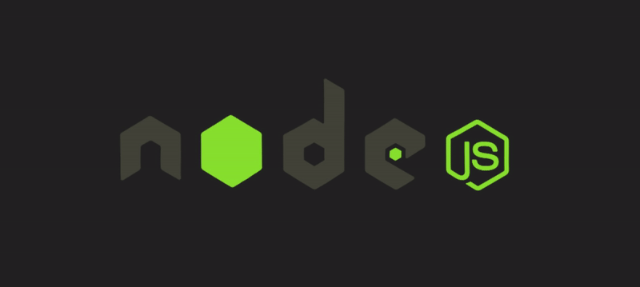

# Backend Services Documentation



## Overview

This project consists of two backend services: **Account Manager** and **Payment Manager**. These services manage user accounts, transactions, and handle payment operations with support for recurring payments.

## Tech Stack

- **Node.js**: API server
- **Fastify**: Web framework
- **Prisma**: ORM for database interactions
- **PostgreSQL**: Database
- **Docker**: Containerization
- **Swagger**: API documentation

## Setup

### Prerequisites

- Node.js (v18+ recommended)
- Docker (for containerization)

### Installation

1. **Clone the Repository:**
    ```bash
    git clone https://github.com/jibranfawaid/be-assignment.git
    cd be-assignment
    ```

2. **Ensure the Database Exists:**

   Make sure your PostgreSQL database exists and is accessible. You can use `pgAdmin` or command-line utilities to create the database if it doesn't already exist.

   ```sql
   CREATE DATABASE account_manager
   CREATE DATABASE payment_manager
   ```

3. **Run Docker Compose:**

   Start the application and database services using Docker Compose:

    ```bash
    docker-compose up
    ```

   This will build and start your services as defined in the `docker-compose.yml` file.

4. **Run Database Migrations:**

   If not using Docker, run database migrations to set up the database schema on each service:

    ```bash
    npx prisma migrate dev
    ```

5. **Start the Application:**

   If running without Docker, start the application:

    ```bash
    npm start
    ```

## API Documentation

### Register User

- **Endpoint**: `/register`
- **Method**: `POST`
- **Description**: Registers a new user and creates default accounts with a balance of 10000.
- **Request Body**:
  - `email`: User email
  - `password`: User password
- **Response**:
  - `201 Created`: User created successfully
  - `400 Bad Request`: Validation errors or email already registered

### Authentication

- **Endpoint**: `/login`
- **Method**: `POST`
- **Description**: Authenticates a user and provides a JWT token.
- **Request Body**:
  - `email`: User email
  - `password`: User password
- **Response**:
  - `200 OK`: Returns the JWT token
  - `401 Unauthorized`: Invalid credentials

### Check Balance

- **Endpoint**: `/check-balance`
- **Method**: `POST`
- **Description**: Checks the balance of a user's account.
- **Request Body**:
  - `userId`: User ID
  - `accountType`: Type of account (`credit`, `debit`, `loan`)
- **Response**:
  - `200 OK`: Returns the account balance
  - `400 Bad Request`: Validation errors
  - `404 Not Found`: Account not found

### Send Payment

- **Endpoint**: `/send`
- **Method**: `POST`
- **Description**: Sends money from one account to another.
- **Request Body**:
  - `amount`: Amount to send
  - `toAddress`: Recipient address
  - `accountType`: Type of account (`credit`, `debit`, `loan`)
- **Response**:
  - `200 OK`: Transaction processed successfully
  - `400 Bad Request`: Validation errors
  - `500 Internal Server Error`: Transaction processing error

### Withdraw Payment

- **Endpoint**: `/withdraw`
- **Method**: `POST`
- **Description**: Withdraws money from a user's account.
- **Request Body**:
  - `amount`: Amount to withdraw
  - `toAddress`: Withdrawal address
  - `accountType`: Type of account (`credit`, `debit`, `loan`)
- **Response**:
  - `200 OK`: Transaction processed successfully
  - `400 Bad Request`: Validation errors
  - `500 Internal Server Error`: Transaction processing error

### Get Payment History

- **Endpoint**: `/payment-history`
- **Method**: `GET`
- **Description**: Retrieves payment history for a user with pagination.
- **Query Parameters**:
  - `page`: Page number (default: 1)
  - `limit`: Number of items per page (default: 10)
- **Response**:
  - `200 OK`: Returns payment history
  - `400 Bad Request`: Validation errors
  - `500 Internal Server Error`: Error retrieving payment history

### Update Balance

- **Endpoint**: `/update-balance`
- **Method**: `POST`
- **Description**: Updates the balance of a user's account.
- **Request Body**:
  - `userId`: User ID
  - `accountType`: Type of account (`credit`, `debit`, `loan`)
  - `amount`: Amount to subtract from the balance
- **Response**:
  - `200 OK`: Balance updated successfully
  - `400 Bad Request`: Validation errors
  - `404 Not Found`: Account not found
  - `500 Internal Server Error`: Error updating balance

## Swagger Documentation

To view the API documentation using Swagger, run the application and navigate to:

`http://localhost:3000/docs`
`http://localhost:3001/docs`

## Postman Collections

You can import the following Postman files to test the APIs:

- **Postman Collection**: `./docs/Concrete AI.postman_collection.json`
- **Postman Environment**: `./docs/Dev.postman_environment.json`

## Notes

- Ensure PostgreSQL is running and accessible.
- Modify `DATABASE_URL` and `ACCOUNT_SERVICE_URL` in the `.env` file according to your setup.
- Running Docker Compose will set up both the database and application services.
